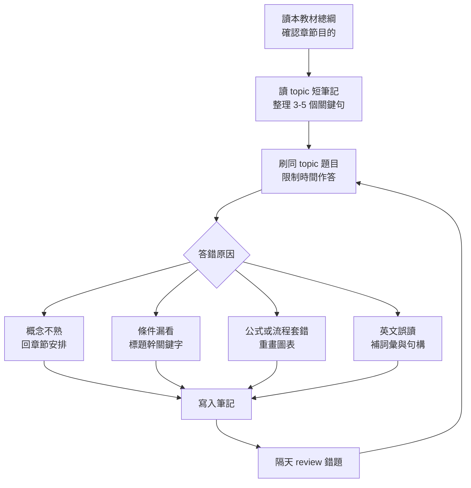
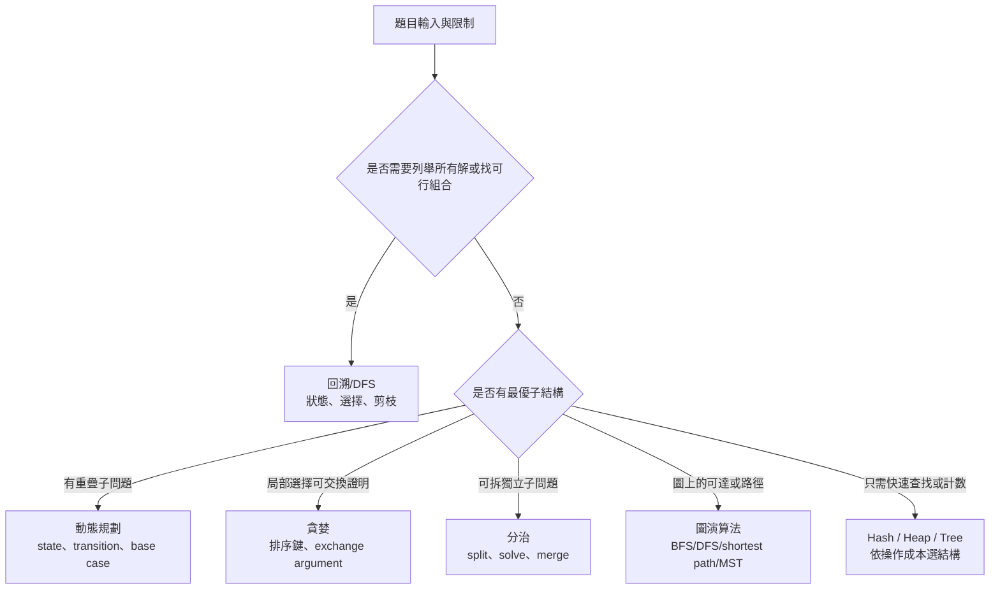
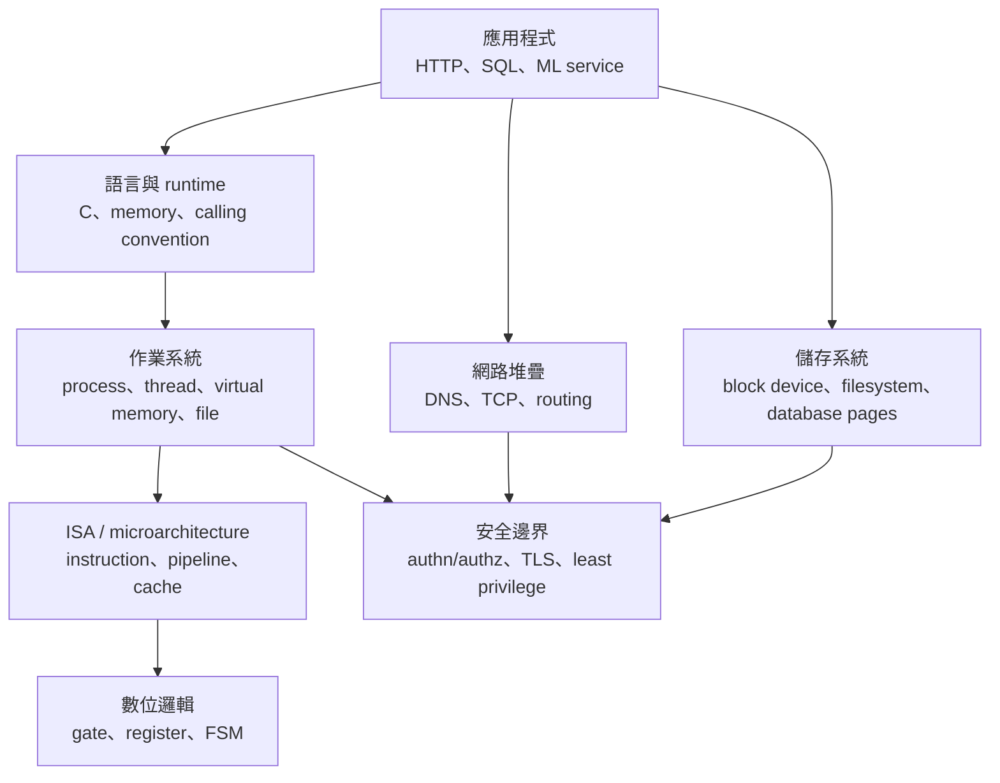
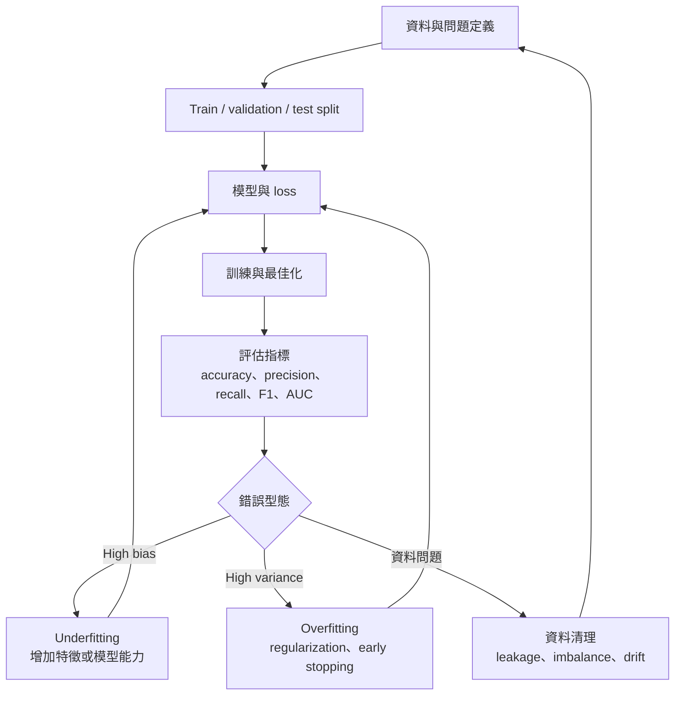
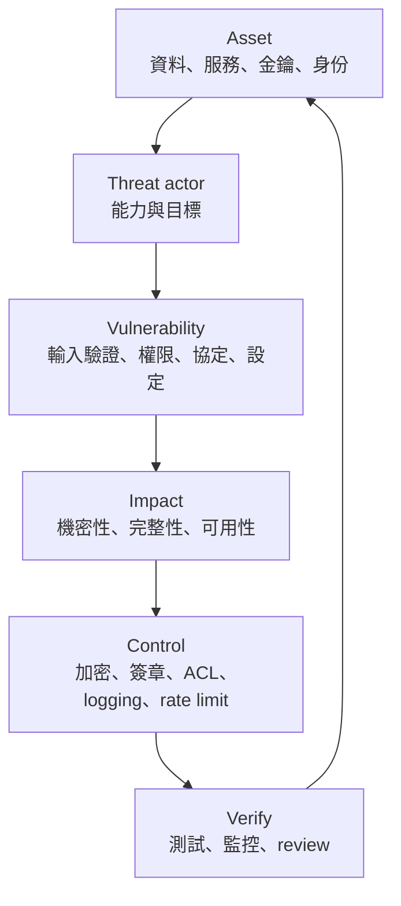

# Study Drill Platform 自編教材總綱

這份教材是為一位已有工程背景、目標轉外商並往 Senior RD 前進的學習者設計。它不是考古題逐字整理，也不是商用教材摘錄；它把公開課綱、常見大學教材章節與台灣資工所考科重點重新組織成「先建立概念模型，再用題目檢查盲點」的學習路線。

教材和題庫的關係是：教材負責建立可遷移的理解，題庫負責逼你在時間壓力下辨識概念、排除陷阱、補弱點。每章都應搭配平台的同名 topic 練習。

## 使用方式

每個 topic 建議用四段式循環，不要只看講義或只刷題：

1. 先讀本教材的「學習目標」與「章節安排」，抓出這章到底在解決什麼問題。
2. 到 `content/<subject>/<topic>.md` 看較短的教學筆記，整理 3 到 5 個自己的關鍵句。
3. 進入 `/practice` 做同 topic 題目，錯題立刻寫入筆記：錯因只分成概念不熟、條件漏看、公式套錯、實作細節、英文誤讀。
4. 隔天用 `/review` 重做錯題；若同一章連續錯 3 題，回到本教材重讀章節安排，不要急著加題量。

## 教材設計原則

- 以資工所核心科目為主軸：資料結構、演算法、作業系統、計算機組織、網路、資料庫、離散數學、線性代數、機率統計。
- 以工程師升級為第二主軸：C 語言記憶體模型、系統效能、資料庫交易、網路協定、ML 評估、安全威脅模型、技術英文。
- 章節順序採「抽象層次」而不是單純照書排：資料表示和 C 記憶體先打底，再進架構、OS、網路、DB；數學則先證明與集合，再進線代、機率、ML。
- 每章都要能接到選擇題：定義題、比較題、情境判斷題、計算題、程式碼/系統行為題。
- 內容只做原創整理與重寫；市場教材只用來校準範圍、難度與章節順序。

## 完整性檢核

這裡的「完整」定義為：足以支撐資工所核心考科、工程師系統設計/面試基本盤、以及你往 Senior RD 前進時需要補齊的底層概念。它不是整個 Computer Science 的百科全書；compiler、distributed systems、advanced cryptography、advanced NLP/CV 等主題目前不列入本輪，除非之後新增科目與題庫。

| 科目 | 目前章節 | 參考基準 | 完整性判斷 | 圖表輔助 |
|---|---:|---|---|---|
| algorithms | 6 | MIT 6.006 的建模、複雜度、資料結構與演算法範式 | 核心完整；DP/圖論/貪婪/分治/搜尋均覆蓋 | 全局路線圖、演算法選型圖 |
| data-structures | 7 | 常見 CS2/DSA 教材的 array、list、tree、hash、heap、stack/queue | 核心完整；進階樹與圖結構已有入口 | 全局路線圖、演算法選型圖 |
| programming | 2 | CS50 與系統程式基礎中的 C、指標、記憶體模型 | 考研與系統底層打底完整；大型軟工模式暫不納入 | 系統堆疊圖 |
| computer-organization | 4 | MIT 6.004 與 CSAPP 的資料表示、數位邏輯、pipeline、cache | 核心完整；assembly/compilers 只保留必要背景 | 系統堆疊圖 |
| operating-systems | 6 | OSTEP 的 virtualization、concurrency、persistence 三主軸 | 核心完整；分散式 OS 不列入本輪 | 系統堆疊圖 |
| networking | 5 | Top-Down Networking 的 application、transport、network 分層 | 核心完整；wireless/SDN 只作延伸方向 | 系統堆疊圖 |
| databases | 5 | CMU 15-445 的 relational model、SQL、index、transaction、optimizer | 核心完整；distributed DB 先不列入 | 資料庫查詢與交易圖 |
| discrete-math | 5 | MIT 6.042J 的集合、邏輯、證明、計數、圖論、關係 | 核心完整；數論只保留資安會用到的必要背景 | 全局路線圖 |
| linear-algebra | 4 | MIT 18.06 的矩陣、空間、秩、線性轉換、特徵值 | ML 與考研核心完整；數值線代先不納入 | 全局路線圖、ML 評估圖 |
| probability-statistics | 3 | Stat 110/6.041 的條件機率、隨機變數、估計與檢定 | 核心完整；隨機過程先不納入 | 全局路線圖、ML 評估圖 |
| machine-learning | 4 | Stanford CS229 的 supervised learning、評估、正則化、NN 基礎 | 工程與考題入門完整；RL/advanced generative AI 先不納入 | ML 評估圖 |
| artificial-intelligence | 1 | Berkeley CS188 的搜尋、heuristic、planning 基礎 | 搜尋規劃完整；機率圖模型與 RL 先不納入 | 演算法選型圖 |
| information-security | 2 | Web Security Academy 與基礎資安教材的威脅模型、密碼用途 | 入門完整；滲透測試實作與進階密碼學先不納入 | 系統堆疊圖 |
| english | 3 | TOEFL/技術英文閱讀、外商工程溝通情境 | 支援考題閱讀與外商溝通；文學與商英不納入 | 讀書循環圖 |

## 圖表索引

下列圖表用來輔助你快速建立全局地圖。讀每章正文前先看對應圖表，刷題後再回來確認自己錯在哪一層。

### 全局學習路線

```mermaid
flowchart LR
    DM["離散數學<br/>邏輯、證明、計數、圖論"]
    LA["線性代數<br/>矩陣、空間、特徵值"]
    PS["機率統計<br/>條件機率、分布、檢定"]
    C["C 與記憶體<br/>型別、指標、配置"]
    CO["計算機組織<br/>資料表示、pipeline、cache"]
    DS["資料結構<br/>陣列、樹、hash、heap"]
    ALG["演算法<br/>複雜度、分治、貪婪、圖、搜尋"]
    OS["作業系統<br/>process、memory、sync、file"]
    NET["網路<br/>DNS、HTTP、TCP/IP、routing"]
    DB["資料庫<br/>SQL、index、transaction、optimizer"]
    ML["機器學習<br/>評估、正則化、NN"]
    AI["AI 搜尋規劃<br/>state space、A*、planning"]
    SEC["資安<br/>威脅模型、密碼協定"]
    ENG["技術英文<br/>閱讀、詞彙、溝通"]

    DM --> DS
    DM --> ALG
    LA --> ML
    PS --> ML
    C --> CO
    CO --> OS
    DS --> ALG
    ALG --> AI
    OS --> NET
    OS --> DB
    NET --> SEC
    DB --> ML
    ML --> AI
    ENG --> ALG
    ENG --> DB
    ENG --> ML
```

### 讀書循環

### 演算法選型

### 系統堆疊

### 資料庫查詢與交易

```mermaid
flowchart LR
    SQL["SQL query"] --> PARSE["Parse / validate"]
    PARSE --> ALG["Relational algebra"]
    ALG --> OPT["Optimizer<br/>rewrite、join order、cost"]
    OPT --> PLAN["Execution plan"]
    PLAN --> IDX["Index / table scan"]
    IDX --> LOCK["Transaction layer<br/>lock 或 MVCC"]
    LOCK --> PAGE["Buffer pool / pages"]
    PAGE --> LOG["WAL / recovery log"]
    LOG --> RESULT["Result / commit"]
```

### ML 評估

### 資安威脅模型

## 科目教材

下面每個 `subject/topic` 對應平台中的一組題庫與一份短教學筆記。你可以把它當作完整學習路線，也可以當作弱點補洞清單。

## algorithms

演算法這科不要背題型名稱，要訓練三個能力：把問題抽象成狀態、證明策略正確、估算時間與空間成本。市場教材通常從複雜度、排序、資料結構、圖、貪婪、動態規劃一路鋪陳；你的版本要更偏刷題判斷：看到限制條件就知道該排除哪些方法。

### algorithms/backtracking-search

- 學習目標：能把搜尋問題拆成狀態、選擇、約束與終止條件，並判斷何時需要剪枝。
- 章節安排：狀態樹與遞迴框架；可行性檢查與剪枝；排列、組合、子集合問題；CSP 與回溯搜尋的關係。
- 刷題策略：看到「列出所有」「是否存在一組」「限制條件很多」時，先畫狀態樹，再估 branching factor。
- 常見誤區：把 DFS 當成萬用答案，卻沒有說明 visited、撤銷選擇、重複狀態與剪枝條件。

### algorithms/complexity-dp-graphs

- 學習目標：能用漸進符號比較方法成本，並辨識動態規劃和圖演算法的共同結構。
- 章節安排：Big-O、Theta、Omega；遞迴式與主定理直覺；DP 的 state/transition/base case；圖搜尋與最短路徑的複雜度。
- 刷題策略：每題先寫輸入規模，再問「狀態數多少、每個狀態轉移成本多少」。
- 常見誤區：只背公式，不會從程式迴圈、遞迴樹或資料結構操作推出複雜度。

### algorithms/divide-and-conquer

- 學習目標：能判斷一個問題是否可拆成獨立子問題，並用合併步驟控制總成本。
- 章節安排：分治三步驟；merge sort 與 binary search；快速選擇與快速排序；遞迴式與邊界條件。
- 刷題策略：遇到排序、搜尋、區間、最大/最小子問題時，先確認子問題是否獨立。
- 常見誤區：把分治和 DP 混在一起；DP 會重用重疊子問題，分治通常不重疊。

### algorithms/graph-algorithms

- 學習目標：能根據圖的性質選擇 BFS、DFS、拓撲排序、最短路徑或 MST。
- 章節安排：圖表示法；BFS/DFS 與連通性；Dijkstra、Bellman-Ford、Floyd-Warshall；Kruskal/Prim 與 cut property。
- 刷題策略：先標出 directed/undirected、weighted/unweighted、negative edge、DAG，再選演算法。
- 常見誤區：在有負權邊時誤用 Dijkstra，或把 BFS 的層數性質用在 weighted graph。

### algorithms/greedy

- 學習目標：能辨識何時局部最佳會推出全域最佳，並能用 exchange argument 或 cut property 支撐。
- 章節安排：貪婪選擇性質；活動選擇與區間排程；Huffman coding；MST 與最短路徑中的貪婪。
- 刷題策略：先找排序鍵，再檢查是否能交換任一最佳解的第一步。
- 常見誤區：只因為演算法「看起來合理」就選 greedy，沒有檢查反例。

### algorithms/sorting

- 學習目標：理解常見排序的穩定性、in-place 特性、平均/最壞複雜度與適用資料型態。
- 章節安排：comparison sort 下界；insertion/selection/bubble；merge/quick/heap sort；counting/radix sort。
- 刷題策略：題目問「穩定」「額外空間」「近乎有序」「範圍很小」時，先排除不符條件的排序。
- 常見誤區：只背 O(n log n)，忽略 quicksort 最壞情況、merge sort 空間、counting sort 的值域成本。

## artificial-intelligence

AI 這科在考研裡通常不會像研究所課程那麼深，但會測搜尋、規劃、推理與不確定性。你的重點不是追最新模型，而是理解智能系統如何把問題形式化。

### artificial-intelligence/search-planning

- 學習目標：能把 AI 問題表示成 state space，並比較 uninformed search、informed search 與 planning。
- 章節安排：agent 與 environment；BFS/DFS/UCS/A*；heuristic 的 admissible/consistent；planning problem 與目標條件。
- 刷題策略：題目若提供成本與啟發式，先檢查 heuristic 性質，再判斷 optimality 和 completeness。
- 常見誤區：把 A* 等同「一定最快」，忽略 heuristic 品質與記憶體成本。

## computer-organization

計算機組織要把「程式碼如何變成硬體行為」講清楚。你的工程背景會有幫助，但考題常卡在資料表示、指令、pipeline、cache 與效能估算。

### computer-organization/architecture-basics

- 學習目標：理解 ISA、datapath、control、memory hierarchy 的分工，能說明一行程式如何被執行。
- 章節安排：von Neumann model；指令週期；RISC/CISC 基本差異；CPU、memory、I/O 的資料流。
- 刷題策略：先判斷題目是在問 ISA 層、microarchitecture 層，還是 OS/Compiler 層。
- 常見誤區：把 instruction set 和 processor implementation 混為一談。

### computer-organization/data-representation

- 學習目標：能處理補數、overflow、floating point、endianness 與位元運算。
- 章節安排：二進位與十六進位；two's complement；IEEE 754 直覺；bit masking 與 shift。
- 刷題策略：遇到 overflow 題，先分 signed/unsigned，再看運算規則。
- 常見誤區：用十進位直覺判斷二補數邊界，或忘記 floating point 不能精確表示多數小數。

### computer-organization/digital-logic

- 學習目標：能從 Boolean expression 推到組合邏輯，並理解 sequential circuit 的狀態概念。
- 章節安排：truth table 與 Karnaugh map；combinational circuit；flip-flop 與 register；finite state machine。
- 刷題策略：邏輯題先列 truth table，再簡化，不要直接猜 gate 組合。
- 常見誤區：混淆 latch 和 flip-flop，或忽略 clock edge 對狀態更新的影響。

### computer-organization/pipelining-cache

- 學習目標：理解 pipeline throughput、hazard、cache locality 與效能公式。
- 章節安排：五階段 pipeline；data/control/structural hazard；cache mapping 與 replacement；AMAT。
- 刷題策略：效能題先寫公式：CPI、clock cycle、miss rate、miss penalty，再代數值。
- 常見誤區：把 latency 和 throughput 混用，或只看 cache size 不看 block size、associativity。

## data-structures

資料結構是刷題平台的地基。每個結構都要同時掌握抽象操作、底層表示、時間成本與常見變形。

### data-structures/advanced-trees

- 學習目標：理解平衡樹、B-tree、trie 等樹結構如何控制高度與查詢成本。
- 章節安排：AVL/Red-Black tree 直覺；B-tree/B+ tree；trie；區間樹與 segment tree 概念。
- 刷題策略：題目若問大量查詢、插入刪除、範圍查找，先想高度與分支因子。
- 常見誤區：只記旋轉步驟，卻不懂平衡條件如何維持 O(log n)。

### data-structures/arrays

- 學習目標：掌握連續記憶體、indexing、amortized resizing 與 cache locality。
- 章節安排：static array vs dynamic array；random access；插入刪除成本；two pointers 與 sliding window。
- 刷題策略：看到連續區間、排序後掃描、固定窗口，先試 array-based 解法。
- 常見誤區：以為 array 所有操作都是 O(1)，忽略中間插入與 resize。

### data-structures/hash-tables

- 學習目標：理解 hash function、collision handling、load factor 與平均/最壞成本。
- 章節安排：direct addressing；chaining；open addressing；rehashing 與安全性風險。
- 刷題策略：題目要快速 membership/counting/grouping 時，先檢查 key 是否可 hash。
- 常見誤區：只記平均 O(1)，忽略 collision、hash quality 與 iteration order 不保證。

### data-structures/heaps-priority-queues

- 學習目標：理解 heap invariant 與 priority queue 的操作成本。
- 章節安排：binary heap；heapify；insert/extract-min；top-k、median、Dijkstra 應用。
- 刷題策略：遇到「每次取最大/最小」「動態 top-k」時優先考慮 heap。
- 常見誤區：把 heap 當成完全排序結構；heap 只保證 root 是極值。

### data-structures/linked-lists

- 學習目標：掌握 pointer linking、dummy node、快慢指標與原地修改。
- 章節安排：singly/doubly linked list；插入刪除；cycle detection；reverse list。
- 刷題策略：指標題先畫節點與 next 變化，避免只在腦中模擬。
- 常見誤區：更新指標順序錯誤導致斷鏈，或忘記處理 head/tail/null。

### data-structures/stacks-queues

- 學習目標：理解 LIFO/FIFO 對應的問題型態，並能用 deque 處理雙端操作。
- 章節安排：stack 與 call stack；queue 與 BFS；monotonic stack/queue；括號與表達式解析。
- 刷題策略：看到最近未匹配、層序展開、下一個更大元素，先想 stack/queue。
- 常見誤區：把 stack/queue 當成語法題，忽略它們其實在保存「等待被處理的狀態」。

### data-structures/trees-graphs-hashing

- 學習目標：把 tree、graph、hashing 串成問題建模工具，而不是孤立資料結構。
- 章節安排：tree traversal；graph adjacency list/matrix；hash set/map；結構選擇與複雜度比較。
- 刷題策略：先問資料是否有階層、關聯或快速查找需求，再選結構。
- 常見誤區：一看到節點就用 tree，卻忽略圖可能有 cycle 或多重關係。

## databases

資料庫教材要分成兩層：SQL/模型是你使用 DB 的語言，storage/index/transaction/query optimization 是你判斷效能與一致性的能力。

### databases/indexing

- 學習目標：理解 index 如何降低 I/O，並能比較 B+ tree、hash index 與 composite index。
- 章節安排：page 與 disk I/O；B+ tree；clustered/non-clustered index；selectivity 與 covering index。
- 刷題策略：看到查詢條件，先判斷 equality、range、order by、join key 如何利用 index。
- 常見誤區：以為 index 越多越好，忽略寫入成本、維護成本與 optimizer 選擇。

### databases/normalization

- 學習目標：掌握 functional dependency、normal forms 與 schema decomposition。
- 章節安排：FD closure；candidate key；1NF/2NF/3NF/BCNF；lossless join 與 dependency preservation。
- 刷題策略：正規化題先求 key，再逐一檢查違反哪個 normal form。
- 常見誤區：把正規化當背定義，沒有用 FD 判斷 anomaly 來源。

### databases/query-optimization

- 學習目標：理解 optimizer 如何用統計資訊、join order 與 access path 降低成本。
- 章節安排：relational algebra rewrite；selection/projection pushdown；join algorithms；cost estimation。
- 刷題策略：比較執行計畫時，先估 row count，再看 I/O 與 join method。
- 常見誤區：只看 SQL 寫法，不看資料分布與索引是否改變最佳計畫。

### databases/sql

- 學習目標：能正確使用 SELECT、JOIN、GROUP BY、subquery、window function 的邏輯順序。
- 章節安排：relational model；where/group/having/order；inner/outer join；aggregate 與 null。
- 刷題策略：SQL 題先畫輸入表與中間結果，不要靠語感判斷。
- 常見誤區：混淆 WHERE 和 HAVING，或在 outer join 後用 WHERE 意外消除 null row。

### databases/transactions

- 學習目標：理解 ACID、isolation level、serializability、locking 與 MVCC。
- 章節安排：transaction anomalies；2PL；deadlock；timestamp/MVCC；recovery log。
- 刷題策略：並行題先列操作序列，再標出 read/write conflict。
- 常見誤區：以為 read committed 就不會有一致性問題，忽略 non-repeatable read 和 phantom。

## discrete-math

離散數學的重點不是計算量，而是「精確表述」與「證明」。它會支撐演算法正確性、資料庫關係、圖論與機率。

### discrete-math/combinatorics-counting

- 學習目標：能判斷排列、組合、重複、排容與遞迴計數。
- 章節安排：加法/乘法原理；permutation/combination；pigeonhole；inclusion-exclusion；recurrence。
- 刷題策略：計數題先問元素是否有順序、是否可重複、是否有限制。
- 常見誤區：把「選」和「排」混用，或重複計數後沒有除掉對稱性。

### discrete-math/foundations

- 學習目標：建立集合、命題、函數、關係與證明語言的共同基礎。
- 章節安排：sets；propositions；quantifiers；functions；proof by contradiction/induction。
- 刷題策略：看到「for all」「exists」先翻成量詞，再判斷否定形式。
- 常見誤區：用例子當證明，或把命題的 converse/inverse/contrapositive 搞混。

### discrete-math/graph-theory

- 學習目標：理解 graph 的基本定義、路徑、連通、樹、平面圖與染色問題。
- 章節安排：degree 與 handshaking lemma；path/cycle；tree properties；bipartite graph；Euler/Hamilton。
- 刷題策略：先確認圖是否 simple、directed、weighted，再使用對應定理。
- 常見誤區：把 Euler path 和 Hamilton path 的條件混淆。

### discrete-math/logic-proofs

- 學習目標：能讀懂邏輯式，並用 direct proof、contradiction、induction 建立嚴謹推理。
- 章節安排：truth table；implication；predicate logic；proof methods；mathematical induction。
- 刷題策略：證明題先寫清楚假設與要證結論，再選方法。
- 常見誤區：未處理 base case，或 induction step 偷用了尚未證明的結論。

### discrete-math/relations-functions

- 學習目標：掌握 relation properties、equivalence relation、partial order 與 function mapping。
- 章節安排：reflexive/symmetric/transitive；equivalence class；poset；injective/surjective/bijective。
- 刷題策略：關係題用小集合列 matrix 或 directed graph 來檢查性質。
- 常見誤區：把 symmetric 和 antisymmetric 當成互斥概念。

## english

英文在這個平台不是單純背單字，而是支援外商面試、技術文件閱讀與英文題幹理解。重點是技術語境下的精準理解。

### english/communication

- 學習目標：能用清楚英文描述設計取捨、bug 分析、實作進度與不確定性。
- 章節安排：status update；trade-off explanation；incident/bug report；interview answer structure。
- 刷題策略：把每個技術答案改寫成一句 claim、兩句 evidence、一句 caveat。
- 常見誤區：用很多形容詞但沒有具體條件、數據或限制。

### english/reading-comprehension

- 學習目標：能快速理解技術/學術段落的主旨、轉折、因果與作者立場。
- 章節安排：topic sentence；reference words；contrast markers；inference questions；detail scanning。
- 刷題策略：先標 but/however/therefore/because，再回題目找定位句。
- 常見誤區：逐字翻譯導致時間不夠，或把例子當成主旨。

### english/vocabulary

- 學習目標：建立工程、學術與面試常見詞的語境記憶，而不是孤立背中文翻譯。
- 章節安排：academic verbs；engineering nouns；modality words；collocation；word family。
- 刷題策略：每個字記一個技術句，例如 deprecated API、mitigate risk、constrain scope。
- 常見誤區：只背單字表，實際讀題時不知道詞性與搭配。

## information-security

資安教材要先建立威脅模型，再學攻防技術。考題常測基礎概念、密碼學用途、協定流程與常見 web 風險。

### information-security/crypto-protocols

- 學習目標：理解 symmetric/asymmetric crypto、hash、signature、TLS 等協定用途。
- 章節安排：confidentiality/integrity/authentication；hash/MAC/signature；key exchange；TLS handshake 直覺。
- 刷題策略：每題先問要保護的是機密性、完整性、身分或不可否認性。
- 常見誤區：把 encryption、hash、signature 當成可互換工具。

### information-security/fundamentals

- 學習目標：建立 CIA triad、threat model、access control、common vulnerabilities 的基礎。
- 章節安排：asset/threat/vulnerability；authentication vs authorization；least privilege；OWASP 常見風險。
- 刷題策略：情境題先列攻擊者能力與防守目標，再選控制措施。
- 常見誤區：只記漏洞名稱，不會說明前置條件、影響與修補方向。

## linear-algebra

線性代數是 ML、圖、最佳化與資料分析的語言。考研常測矩陣運算、向量空間、rank、determinant、eigenvalue，學習時要兼顧計算與幾何直覺。

### linear-algebra/determinants-eigenvalues

- 學習目標：理解 determinant、eigenvalue/eigenvector 如何描述線性轉換的縮放與不變方向。
- 章節安排：determinant properties；characteristic polynomial；diagonalization；symmetric matrix。
- 刷題策略：先看矩陣是否 triangular、symmetric、rank deficient，再選計算捷徑。
- 常見誤區：只會展開行列式，卻不懂 determinant 為零代表不可逆與體積壓扁。

### linear-algebra/linear-transformations

- 學習目標：能把矩陣看成線性映射，理解 kernel、image、basis change。
- 章節安排：linear map definition；matrix representation；null space/column space；change of basis。
- 刷題策略：遇到轉換題，先問 domain/codomain 維度與基底。
- 常見誤區：把矩陣乘法當純運算，忽略它代表函數合成。

### linear-algebra/matrices-vector-spaces

- 學習目標：掌握 vector space、subspace、basis、dimension 與矩陣基本操作。
- 章節安排：span/independence；basis/dimension；matrix operations；orthogonality 直覺。
- 刷題策略：判斷 subspace 時檢查 zero vector、closure under addition/scalar multiplication。
- 常見誤區：看到一組向量就直接算 determinant，卻沒有先確認是否為方陣。

### linear-algebra/systems-rank

- 學習目標：能用 row reduction、rank-nullity 與 augmented matrix 判斷線性方程組解的型態。
- 章節安排：Gaussian elimination；rank；pivot/free variables；consistent/inconsistent systems。
- 刷題策略：方程組題先化成 row echelon form，再讀 pivot 數與自由變數。
- 常見誤區：把未知數個數和解的唯一性直接畫等號，忽略 rank。

## machine-learning

ML 教材要把「建模問題」和「工程評估」綁在一起。你不需要先追最深模型，而要能判斷資料、損失、泛化、評估指標與部署風險。

### machine-learning/fundamentals

- 學習目標：理解 supervised/unsupervised learning、loss、optimization、train/validation/test split。
- 章節安排：problem framing；features/labels；linear/logistic regression；gradient descent；data leakage。
- 刷題策略：每題先分分類/回歸/分群，再看資料切分與目標函數。
- 常見誤區：把高訓練準確率當成模型好，忽略泛化。

### machine-learning/model-evaluation

- 學習目標：能選擇 accuracy、precision、recall、F1、ROC-AUC、MAE/RMSE 等指標。
- 章節安排：confusion matrix；class imbalance；cross-validation；calibration；error analysis。
- 刷題策略：指標題先問 false positive 和 false negative 哪個代價較高。
- 常見誤區：在 imbalanced data 只看 accuracy。

### machine-learning/neural-networks

- 學習目標：理解神經網路的 layer、activation、backpropagation 與 optimization 基礎。
- 章節安排：perceptron/MLP；activation functions；loss and gradients；regularization；CNN/RNN/Transformer 概念。
- 刷題策略：不要背模型名；先問輸入型態、輸出任務、參數共享與序列/空間結構。
- 常見誤區：把 deep learning 當黑盒，無法解釋 overfitting、vanishing gradient 或資料量需求。

### machine-learning/overfitting-regularization

- 學習目標：理解 bias-variance tradeoff，並能用 regularization、early stopping、data augmentation 控制泛化。
- 章節安排：underfit/overfit；L1/L2；dropout；early stopping；validation curve。
- 刷題策略：看到 train good / validation bad，先判斷是 overfitting、data leakage 還是分布漂移。
- 常見誤區：只想加模型複雜度，沒有先檢查資料品質和切分。

## networking

網路教材用 top-down 順序學會比較自然：先從 application layer 看到 HTTP/DNS，再往 transport、network、link 與路由。考題常測協定職責、延遲、可靠傳輸與位址。

### networking/dns

- 學習目標：理解 DNS 名稱解析、快取、遞迴/迭代查詢、record type 與故障模式。
- 章節安排：hierarchy；A/AAAA/CNAME/MX/TXT；recursive resolver；TTL/cache；DNSSEC 直覺。
- 刷題策略：解析流程題先畫 client、resolver、root、TLD、authoritative server。
- 常見誤區：以為 DNS 只是查 IP，忽略 cache、TTL 與 authority。

### networking/http

- 學習目標：掌握 HTTP request/response、method、status code、cache、cookie/session、HTTPS。
- 章節安排：HTTP message；GET/POST/PUT/DELETE；2xx/3xx/4xx/5xx；cache headers；TLS 與 HTTP/2/3 概念。
- 刷題策略：題目問 web 行為時，先分 transport、安全、application state。
- 常見誤區：把 HTTP 無狀態理解成 server 不能保存 session。

### networking/osi-tcp-ip-model

- 學習目標：理解分層模型如何隔離責任，能把協定放到正確層次。
- 章節安排：OSI vs TCP/IP；encapsulation；service vs protocol；layer violation 的代價。
- 刷題策略：每題問「這個欄位或協定解決哪一層的問題」。
- 常見誤區：死背七層名稱，卻不會判斷實際封包流。

### networking/routing-subnetting

- 學習目標：能處理 CIDR、subnet mask、routing table、longest prefix match。
- 章節安排：IP addressing；subnetting；route aggregation；static/dynamic routing；NAT。
- 刷題策略：子網題先轉二進位或用 block size 快算 network/broadcast/host range。
- 常見誤區：把子網遮罩當十進位字串背，不會推 prefix range。

### networking/transport-layer

- 學習目標：比較 TCP/UDP，理解可靠傳輸、flow control、congestion control。
- 章節安排：ports/sockets；TCP handshake；sequence/ack；sliding window；loss and retransmission。
- 刷題策略：看到延遲、丟包、順序、可靠性，就先判斷 transport 層機制。
- 常見誤區：以為 UDP 一定比較快，忽略應用層可能自己補可靠性與重傳。

## operating-systems

作業系統用三大塊學：virtualization、concurrency、persistence。你的目標是能解釋 process/thread/memory/file/I/O 的抽象如何提供隔離、共享與效能。

### operating-systems/file-systems

- 學習目標：理解 file abstraction、directory、inode、allocation、journaling 與 crash consistency。
- 章節安排：file metadata；directory structure；block allocation；free space；journaling/logging。
- 刷題策略：檔案系統題先分 metadata update 和 data block update。
- 常見誤區：只看檔案名稱，忘記真正定位資料的是 inode/metadata。

### operating-systems/io-storage

- 學習目標：理解 I/O stack、device driver、interrupt、DMA、disk/SSD 基本效能。
- 章節安排：polling vs interrupt；DMA；block device；disk scheduling；SSD 特性。
- 刷題策略：效能題先拆 seek、rotation、transfer 或 SSD erase/write amplification。
- 常見誤區：用 HDD 的 seek 直覺套到 SSD。

### operating-systems/processes-threads

- 學習目標：掌握 process、thread、context switch、address space、system call。
- 章節安排：process abstraction；PCB；fork/exec/wait；thread shared state；user/kernel mode。
- 刷題策略：並行題先問資源是 per-process 還是 shared among threads。
- 常見誤區：把 process 和 program 當同義詞，或忽略 thread 共享 address space。

### operating-systems/scheduling

- 學習目標：理解 scheduling policy 如何影響 response time、turnaround time、fairness。
- 章節安排：FIFO/SJF/STCF/RR；priority scheduling；MLFQ；multiprocessor scheduling。
- 刷題策略：排程計算題畫時間軸，逐步標出 ready queue。
- 常見誤區：把 throughput、latency、fairness 當成同一個目標。

### operating-systems/synchronization

- 學習目標：理解 race condition、critical section、lock、semaphore、condition variable、deadlock。
- 章節安排：mutual exclusion；atomic operations；producer-consumer；deadlock conditions；monitor。
- 刷題策略：並行程式題先找 shared variable，再標出可能 interleaving。
- 常見誤區：以為加 lock 就安全，忽略 lock order、lost wakeup 與 deadlock。

### operating-systems/virtual-memory

- 學習目標：理解 address translation、page table、TLB、page fault、replacement。
- 章節安排：virtual/physical address；paging；multi-level page table；TLB；LRU/Clock。
- 刷題策略：地址轉換題先切 VPN/offset，再查 page table/TLB。
- 常見誤區：把 cache miss 和 page fault 混淆；兩者層級與代價不同。

## probability-statistics

機率統計是 ML 與不確定性推理的底層。學習時要少背公式、多練「事件如何表示、條件如何改變樣本空間」。

### probability-statistics/estimation-testing

- 學習目標：理解 estimator、sampling distribution、confidence interval、hypothesis test。
- 章節安排：point estimation；bias/variance；CLT；p-value；Type I/II error。
- 刷題策略：統計檢定題先寫 null/alternative，再看 test statistic 與 rejection rule。
- 常見誤區：把 p-value 解讀成假設為真的機率。

### probability-statistics/probability-basics

- 學習目標：掌握 sample space、event、conditional probability、Bayes rule、independence。
- 章節安排：axioms；counting；conditional probability；Bayes theorem；independence。
- 刷題策略：條件機率題先改寫樣本空間，不要直接套公式。
- 常見誤區：混淆 mutually exclusive 和 independent。

### probability-statistics/random-variables-distributions

- 學習目標：理解 random variable、PMF/PDF/CDF、expectation、variance 與常見分布。
- 章節安排：discrete/continuous RV；expectation；Bernoulli/Binomial/Geometric/Poisson；Normal；joint distribution。
- 刷題策略：分布題先從實驗過程判斷是固定次數、等到成功、單位時間次數還是連續測量。
- 常見誤區：只背期望變異數，卻不知道分布假設是否符合題目。

## programming

程式設計這科以 C 為核心，因為它會連到指標、記憶體、資料結構、系統程式與資安。你的目標是能讀懂程式碼行為，而不只是會寫語法。

### programming/c-language-basics

- 學習目標：掌握 C 的型別、控制流程、函式、array/string 與 compilation model。
- 章節安排：types/operators；control flow；functions；arrays/strings；header/source/compile/link。
- 刷題策略：程式碼題先追變數生命週期、型別轉換與輸出結果。
- 常見誤區：把 C array 當成高階語言 list，忽略邊界與 null terminator。

### programming/pointers-memory

- 學習目標：理解 pointer、address、stack/heap、malloc/free、dangling pointer、buffer overflow。
- 章節安排：pointer basics；pointer arithmetic；dynamic allocation；ownership；common memory bugs。
- 刷題策略：指標題畫記憶體格子，標變數值、地址與指向關係。
- 常見誤區：混淆 pointer variable 本身的值和它指向位置的值。

## 參考教材來源

下列來源只用於校準章節範圍與學習順序，本文內容已重新整理與改寫，沒有收錄原教材段落或商用題目。

- [MIT 6.006 Introduction to Algorithms](https://ocw.mit.edu/courses/6-006-introduction-to-algorithms-spring-2020/)
- [MIT 6.042J Mathematics for Computer Science](https://ocw.mit.edu/courses/6-042j-mathematics-for-computer-science-fall-2010/)
- [MIT 18.06 Linear Algebra](https://ocw.mit.edu/courses/18-06-linear-algebra-spring-2010/)
- [Harvard Statistics 110: Probability](https://stat110.hsites.harvard.edu/)
- [MIT 6.004 Computation Structures](https://ocw.mit.edu/courses/6-004-computation-structures-spring-2017/)
- [Computer Systems: A Programmer's Perspective table of contents](https://csapp.cs.cmu.edu/2e/toc.pdf)
- [Operating Systems: Three Easy Pieces](https://pages.cs.wisc.edu/~remzi/OSTEP/)
- [Computer Networking: A Top-Down Approach table of contents](https://gaia.cs.umass.edu/kurose_ross/Kurose_Ross_TOC_8E.pdf)
- [CMU 15-445/645 Intro to Database Systems](https://15445.courses.cs.cmu.edu/)
- [Stanford CS229 Machine Learning](https://cs229.stanford.edu/)
- [UC Berkeley CS188 Introduction to Artificial Intelligence](https://www2.eecs.berkeley.edu/Courses/CS188/)
- [Harvard CS50 syllabus](https://cs50.harvard.edu/syllabus)
- [PortSwigger Web Security Academy topics](https://portswigger.net/web-security/all-topics)
- [ETS TOEFL iBT Reading section](https://www.ets.org/toefl/test-takers/ibt/about/content/reading.html)
